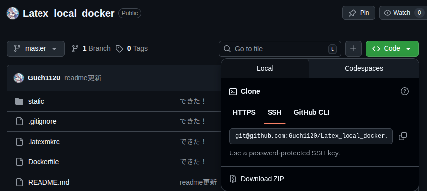
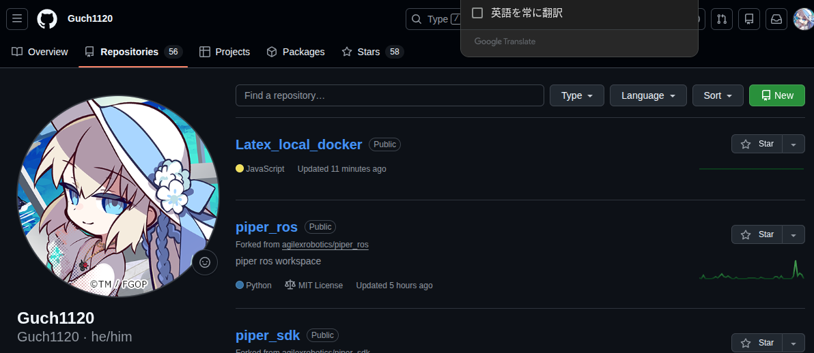
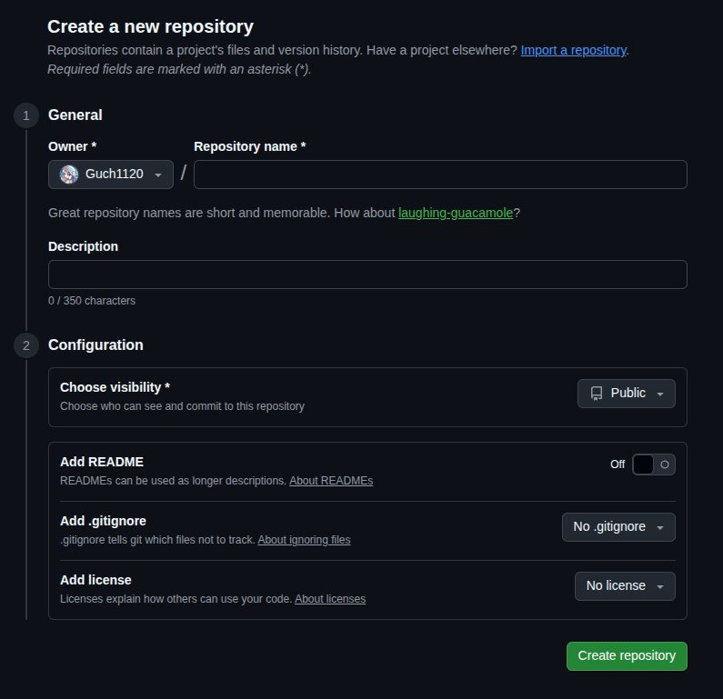

# Web LaTeX Editor

Dockerを使用して動作する、Cloud LaTeX風のWebベースLaTeXエディタ
ファイルの編集、アップロード、画像の挿入、PDFのコンパイルとプレビューが可能

## 必要条件

*   Docker
*   Docker Compose

## セットアップと起動方法

1.  gitクローンではなくzipファイルとしてダウンロード． \
    緑色のcodeボタンを押すと画像のような一覧が出てくるから下のzip downloadを選択．


2. ファイルマネージャからzipファイルを解凍．
3. ターミナルを開いて解凍したディレクトリに移動．
4. そこでgitの設定を始める
    ```bash
    git init
    ```
5. gitの設定をしておく．参考は[Qiita](https://qiita.com/folivora/items/763d06b26bafd573a456). \
   この記事の5-5のコミットまででいい．
6. 自分のgithubのページを開いてRepositoriesに移動する． \
   右上の緑色のNewボタンを押す
   
   リポジトリの名前は好きな名前にする． \
   Descriptionは説明なので適当に．無くてもいい． \
   # Chose visibilityをPrivateにする！！！！ ここ大事!!!!  
   そうしないとうっかり全世界に公開することになる．\
   そこから下はいじらないでOK. \
   readme・gitignore・LICENSEの追加の欄なのでガン無視．
   <details>
   <summary>これらが気になるのなら</summary>

   - readmeは説明
   - gitignoreはgitに上げないファイルの一覧設定
   - LICENSEは著作権に関するファイル．オープンソースにしない限り基本無関係．
   
   </details>

    

7. ここまでできたらgitの準備は完了．あとはdocker環境を立ち上げるだけ．
8. 以下のコマンドを実行してコンテナをビルド・起動
    ```bash
    docker compose up -d --build
    ```
9.ブラウザで [http://localhost:8000](http://localhost:8000) にアクセス
## 使い方

### 画面構成
*   **左側**: ファイルエクスプローラー。作業ディレクトリ内のファイル一覧が表示
    *   システムファイル（`Dockerfile`など）は非表示
    *   `+` ボタンで任意のファイルをアップロード
*   **中央**: エディタ。LaTeXファイルの編集を行います。
    *   `Save (Ctrl+S)`: ファイルを保存
    *   `Insert Image`: 画像をアップロードし、カーソル位置に `\includegraphics` コマンドを挿入
    *   `Compile`: `latexmk` を実行してPDFを生成
    *   `log`: コンパイルログを表示.エラーがあればここに表示される
*   **右側**: PDFプレビュー。コンパイル成功時に自動的に更新される

### 注意事項
*   編集内容はコンテナ内のボリュームに保存される \
    編集するファイルは.texファイルで、コンパイル結果はpdfファイルになる
    ここのファイル群は全部まるっとホストとつなげてる
*   ポート8000番を使用します。変更したい場合は `docker-compose.yml` を編集

## 停止方法

```bash
docker compose down
```
